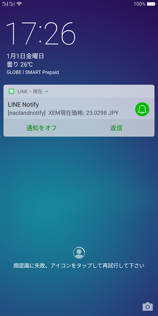

[](https://gitpod.io/#https://github.com/naoland/nemlog-53456)

# 簡単プログラミング！XEMの現在価格をLINEに通知しよう（Python編）

## はじめに

今回はPython言語を使ってXEMの現在価格を取得し、その内容をLINEに通知してみたいと思います。


プログラムの流れとしては、

- LINEのアクセストークンが有効かどうか確認する。
- XEMの現在価格を取得する。
- XEMの現在価格をLINEに通知する。
- エラー（例外）が発生したら、エラー内容を表示して終了。

とシンプルです。
XEMの現在価格をLINEへ通知する際にアクセストークンを使用する点がポイントとなります。

要注意事項: トークンを直接コードに埋め込まないでください。

## 前提条件

[LINEに通知するための準備](#links)までの作業が終わっているのが前提です。トークンの発行が終了していれば、すでに次のようなメッセージが届いているはずです。


## Gitpodでの動作確認

[簡単プログラミング！XEMの現在価格をLINEに通知しよう（Python編）](https://github.com/naoland/nemlog-53456)へアクセスします。


## 実行結果

待ち受け画面に通知が表示されています。`naolandnotify`というのは、前回の記事のトークンを発行する画面で入力した「トークン名」です。
ですので、皆さんがこのプログラムを実行した場合は`naolandnotify`ではなく、皆さんがご自身で入力したトークン名が表示されます。
XEMの現在価格もちゃんと表示されていますね。




タップすると、次のように表示されます。テスト用に何度も送信済みなので、結果がたくさん並んでいます。


## コードの説明

コード全体は[app.py](./app.py)をご覧ください。
今回は[ccxt](https://github.com/ccxt/ccxt)のような取引所関連ライブラリは使用していません。
`Requests`というHTTP通信向けのPythonライブラリを使用します。

「XEMの現在価格を取得するコード」は今まで`JavaScript`を使って記述してきましたが、やることは同じです。

以下、ポイントのみ説明します。

メイン関数はプログラムの流れで説明した通りなので、説明を割愛します。

```python
def main():
    try:
        res = get_status() # トークンが有効かどうか確認する
        print(f"ステータス: {res}")

        price = get_xem_price()
        message = f"XEM現在価格: {price} JPY"
        print(message)

        # LINEに現在価格の情報を含めたメッセージを送信します
        send_line_message(f"{message}")
    except:
        print(sys.exc_info())
```

LINEに通知メッセージを送る部分のコードは次のようになりますが、ポイントはHTTP認証ヘッダーにLINEのパーソナルアクセストークンをセットすることです。
そして、トークンのような機密性の高い情報を、プログラムのソースコード内に記述してはいけません。
一般的には環境変数からトークンの内容を取得します。


```python
# LINEのアクセストークンを環境変数`LINE_TOKEN`から取得します。
# トークンなどの認証に用いられる情報を、誰もが閲覧できるソースコードに記述してはいけません。
LINE_TOKEN = os.environ["LINE_TOKEN"]

def send_line_message(message):
    """ LINEへメッセージを送信する関数 """
    api_url = "https://notify-api.line.me/api/notify"
    # 認証ヘッダーに、環境変数から取得したLINEのトークンをセットします（超重要）
    headers = {"Authorization": f"Bearer {LINE_TOKEN}"}
    data = {"message": f" {message}"}
    response = requests.post(api_url, headers=headers, data=data)
    # 正常終了（200）以外は例外を発生させます
    if response.status_code != 200:
        raise Exception(f"return status code is {response.status_code}")
```


## まとめ


今回はPython言語を使ってXEMの現在価格を取得し、その内容をLINEに通知するプログラムをご紹介しました。

案外簡単だなと思っていただけたなら嬉しいです。`requests`というライブラリを使用しているのもポイントです。

今回採用したPythonは現在非常に人気のあるプログラミング言語ですので、軽く使えるようになっておくとよいでしょう。

ご紹介したプログラムに関して何か質問があれば、コメントくださいね。

たとえば、プログラムの動作のさせ方がわからない場合などは、画面共有などで簡単にお伝えできると思います。


## 関連情報へのリンク
<a id="links"></a>

- [LINEに通知するための準備](https://nemlog.nem.social/blog/53471)
- [現物公開API — Zaif api document v2.0.0 ドキュメント](https://zaif-api-document.readthedocs.io/ja/latest/PublicAPI.html)
- [LINE Notify API Document](https://notify-bot.line.me/doc/ja/)  
上記ドキュメントの「通知系」の箇所をご覧ください。
- [Environment Variables - Gitpod](https://www.gitpod.io/docs/environment-variables/#using-the-command-line-code-classlanguage-textgp-envcode)
- [簡単プログラミング！XEMの現在価格をLINEに通知しよう（Python編）](https://github.com/naoland/nemlog-53456) github
- [簡単プログラミング！XEMの現在価格をLINEに通知しよう（Python編）](https://nemlog.nem.social/blog/53471) nemlog
