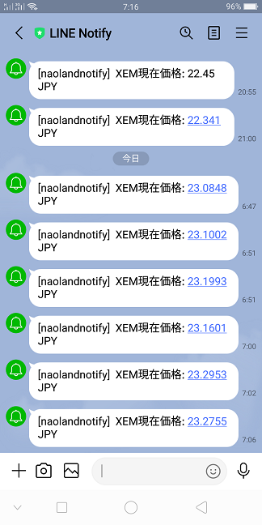

[](https://gitpod.io/#https://github.com/naoland/nemlog-53456)

# 簡単プログラミング！XEMの現在価格をLINEに通知しよう（Python編）

## はじめに

今回はPython言語を使ってXEMの現在価格を取得し、その内容をLINEに通知してみたいと思います。


プログラムの流れとしては、

- LINEのアクセストークンが有効かどうか確認する。
- XEMの現在価格を取得する。
- XEMの現在価格をLINEに通知する。
- エラー（例外）が発生したら、エラー内容を表示して終了。

とシンプルです。
XEMの現在価格をLINEへ通知する際にアクセストークンを使用する点がポイントとなります。

要注意事項: トークンを直接コードに埋め込まないでください。

## 前提条件

[LINEに通知するための準備](#links)までの作業が終わっているのが前提です。トークンの発行が終了していれば、すでに次のようなメッセージが届いているはずです。


## Gitpodでの動作確認


## 実行結果

待ち受け画面に通知が表示されています。`naolandnotify`というのは、前回の記事のトークンを発行する画面で入力した「トークン名」です。
ですので、皆さんがこのプログラムを実行した場合は`naolandnotify`ではなく、皆さんがご自身で入力したトークン名が表示されます。
XEMの現在価格もちゃんと表示されていますね。


タップすると、次のように表示されます。テスト用に何度も送信済みなので、結果がたくさん並んでいます。



## コードの説明

コード全体は[app.py](./app.py)をご覧ください。
今回はccxtのような取引所関連ライブラリは使用せず、一般的なHTTPリクエスト関連の処理を記述します。
`Requests`というHTTP向けのPythonライブラリを使用します。

「XEMの現在価格を取得するコード」は今まで`JavaScript`を使って記述してきましたが、やることは同じです。

```python
```


## まとめ


今回採用したPythonは現在非常に人気のあるプログラミング言語ですので、軽く使えるようになっておくとよいでしょう。

## 関連情報へのリンク
<a id="links"></a>

- [LINEに通知するための準備](https://nemlog.nem.social/blog/53471)
- [現物公開API — Zaif api document v2.0.0 ドキュメント](https://zaif-api-document.readthedocs.io/ja/latest/PublicAPI.html)
- [LINE Notify API Document](https://notify-bot.line.me/doc/ja/)  
上記ドキュメントの「通知系」の箇所をご覧ください。
- Environment Variables - Gitpod  
https://www.gitpod.io/docs/environment-variables/#using-the-command-line-code-classlanguage-textgp-envcode